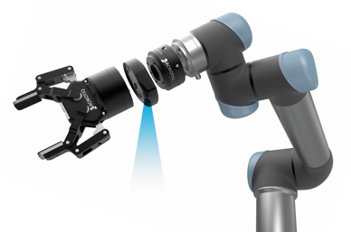
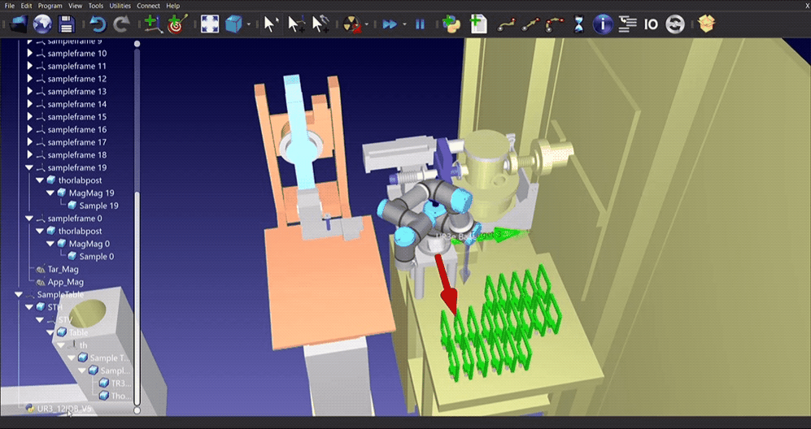
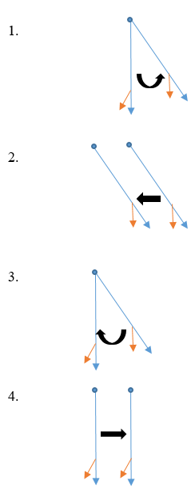

# ur5
RoboDK UR5 development for Argonne National Laboratory

* Setup and Robot Operation Video

 

## Rotation/Translation Sequence
The drawing below is a simplified representation of what the arm is doing. In the drawing below, the blue vector represents the gripper, the orange vector represents the camera and the blue point represents the Tool Center Position (TCP) that the robot translates and rotates about.

1. The robot is over the target then rotates 30 degrees to point the camera in the vertical
2. The robot translates to position the camera directly over the target
3. The robot rotates back 30 degrees to position the gripper in the vertical
4. the robot translates back so that the gripper is directly over the target.

Future work includes adding computer vision to the project so that the camera can autonomously detect targets (lab samples) and translate as needed.

## Requirements
- UR Robot from RoboDK

## Installation 
- link websites for installation
- RoboDK: `https://robodk.com/`

## Run

In the project directory, you can run:

### `UR3_12IDB_V5.py` 

